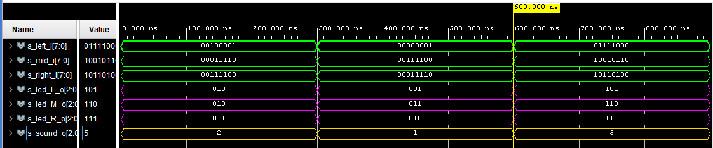
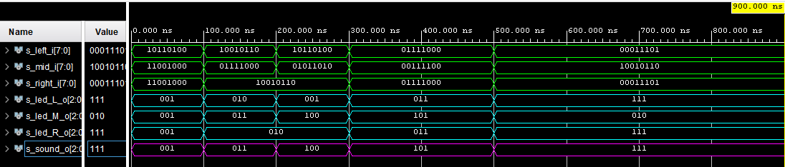

# Control Unit
## Popis modulu 
Řídící jednota získává vzdálenostní data ze Sensor driveru. Jedná se o 3 signály ze tří směrů, které jsou ve formě 8bitového kódu. Signály jsou porovnány a ten který má nejnižší hodnotu představuje nejmenší vzdálenost. Poté jsou signály převedeny na 3bitové a ten který aktuálně reprezentuje nejmenší vzdálenost je odeslán do Sound driveru. Zároveň jsou všechny převedené 3bitové signály zvlášť odeslány do LED driveru pro 3 Led systémy.

## Převod vzdáleností
8bitový signál přivedený na vstup řádící jednotky je podle následující tabulky převeden na 3bitový. Je-li například hodnota v rozmezí 90–119 cm je mu přidělena 3bitová hodnota 100 tedy 4 dekadicky.
### Tabulka převodů
| **Rozmezí BIN** | **Rozmezí DEC [Cm]** | **Výstup BIN** |
   | :-: | :-: | :-: |
   | `0000_0001` - `0001_1101` | `1` - `29` | `111` |
   | `0001_1110` - `0011_1011` | `30` - `59` | `110` |
   | `0011_1100` - `0101_1001` | `60` - `89` | `101` |
   | `0101_1010` - `0111_0111` | `90` - `119` | `100` |
   | `0111_1000` - `1001_0101` | `120` - `149` | `011` |
   | `1001_0110` - `1011_0011` | `150` - `179` | `010` |
   | `1011_0100` - `1100_1000` | `180` - `200` | `001` |
   | `0000_0000` - `1111_1111` | `Disabled` | `000` |

Obrázky simulací ukazují různé stavy, které mohu nastat a potvrzují, že na výstupu pro Sound driveru se nachází vždy ta nejnižší hodnota.

