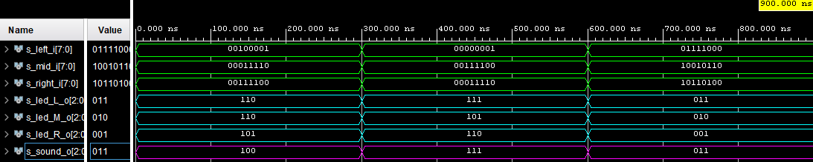

<!DOCTYPE html PUBLIC "-//W3C//DTD HTML 4.01//EN" "http://www.w3.org/TR/html4/strict.dtd">
<html>
<head>
  <meta http-equiv="Content-Type" content="text/html; charset=utf-8">
  <meta http-equiv="Content-Style-Type" content="text/css">
  <title></title>
  <meta name="Generator" content="Cocoa HTML Writer">
  <meta name="CocoaVersion" content="2022.2">
  
</head>
<body>

#control_unit.vhd

  
  # Control Unit
  ### Popis modulu 
Řídící jednota získává vzdálenostní data ze Sensor driveru. Jedná se o 3 signály, které jsou ve formě 8. bitového kódu. Signály jsou porovnány a ten který má nejnižší hodnotu představuje nejmenší vzdálenost. Poté jsou signály převedeny na 3. bitové a ten který aktuálně reprezentuje nejmenší vzdálenost je odeslán do Sound driveru. Zároveň jsou všechny převedené 3. bitové signály zvlášť odeslány do LED driveru.
  
Obrázky simulací ukazují různé stavy, které mohu nastat a potvrzují, že na výstupu pro Sound driveru se nachází vždy ta nejnižší hodnota.
  
  
  
  
  
  
  
  

</body>
</html>
