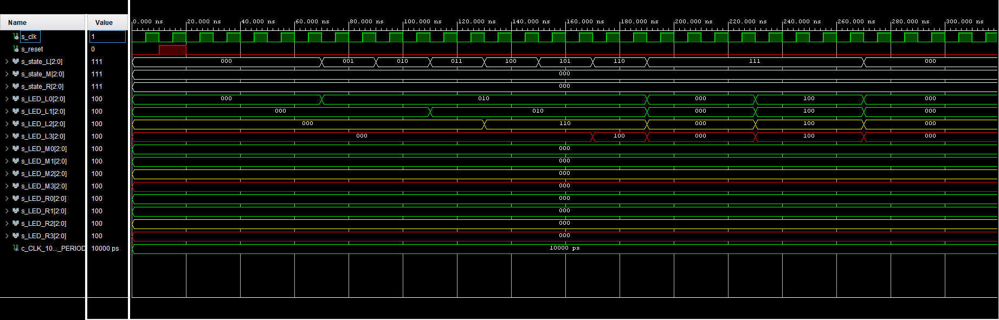

# LED driver
## Popis souboru
- vstupy:
    - `clk` - hodinový signál 100 MHz
    - `reset` 
    - `state_L`, `state_M`, `state_R` - 3x3b, stav senzorů, hodnota určuje vzdálenost od senzoru
- výstupy:
    - pro každou LED diodu 2b ('RGB' = 'XX0')
    - `LED_L0_o` až `LED_L3_o` - 4 diody pro levý směr
    - `LED_M0_o` až `LED_M3_o` - 4 diody pro střed
    - `LED_R0_o` až `LED_R3_o` - 4 diody pro pravý směr
- konstanty:
    - `c_BLINK_TIME` - konstanta udávající frekvenci blikání
    
Do modulu je přiveden vstupní signál pro každý směr. Podle hodoty vstupního 
signálu se přiřadí stav. Pro každý stav je poté vyhodnocen výstup. Jednotlivé 
směry se navzájem neovlivní, každý je vyhodnocen separátně.

Pozn.:
- Původní výstupy byly řešeny jako 3bitové, ale jelikož bude třetí bit pro všechny barvy 
nulový (Red = "100", Green = "010" a Yellow = "110"), třetí bit nepotřebujeme. 
Také bychom pomocí daného počtu portů na desce nemohli takový objem dat přenést.
- Simulace je znárorněna pro 3b výstupy.

## Stavy
- rozlišuje se šest stavů, podle kterých je určen výstup
- `LOW0` - pro vstup `"000"` - na vstupu není nic - LEDky nesvítí
- `LOW1` - pro vstup `"001"` až `"010"` - senzor detekuje něco ve větší 
vzdálenosti - svítí první LED zeleně
- `LOW2` - pro vstup `"011"` - svítí první a druhá LED zeleně
- `MED` - pro vstup `"100"` až `"101"` - objekt je už blíže k 
senzoru - svítí první a druhá LED zeleně a třetí žlutě
- `HIGH1` - pro vstup `"110"` - senzor zaznamenává něco blízkého - 
svítí první a druhá LED zeleně, třetí žlutě a čtvrtá červeně
- `HIGH2` - pro vstup `"111"` - senzor zaznamenává něco velmi blízkého - 
všechny LED diody blikají červeně

### Znázornění stavů - výstup LED

### Vzdálenost od senzoru podle stavu

## Simulace

### Detail výstupů

