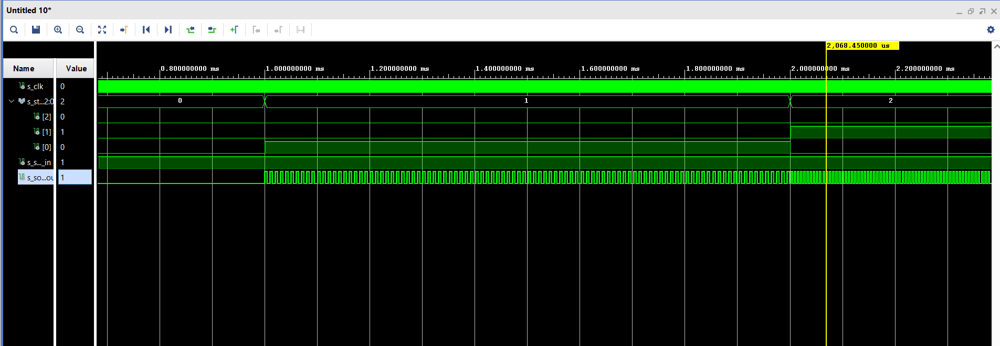

# Sound driver
Obsahuje moduly:
* sound_memory.vhd
* sound_logic.vhd
* pwm DAC `TODO`
* sound_player.vhd

# sound_memory (součást sound_player.vhd)
Modul obsahuje v paměti asi 0.8 sec dlouhý krátký [úsek audia](bump.wav) (mono). Tento výsek je setříhán tak, aby při přehrávání ve smyčce na sebe navazoval a v reproduktoru se tedy neozývalo nepřijemné "lupání".

Sestříhání a úprava vzorku audia byla provedena v programu **LogicProX**. Zvuk má royality free licenci.

Převod do unsigned integeru byl proveden za pomocí [skriptu v MATLABu](waw2array.m). Výsledek je uložen v [.txt souboru](sound_string.txt); pro snadnější formátování po 50 samplech na řádek.

 Audio je normalizováno (pro maximální rozkmit).

**Tech. specifikace modulu:**
* Rozlišení: 8b
* Šíře adresní sběrnice 12b
* Počet uložených vzorků: 2303
* Vzorkovací kmitočet: 96 kHz
* Velikost souboru: 8kiB

### Simulace vyčítání z paměti:

### Detail vyčítání z paměti:

# sound_player.vhd
Modul vyčítá jednotlivé vzorky z paměti v přesně stanovený okamžik dle zadaného parametru vzorkování. 

Tento modul má na starosti práci s pamětí a řízení PWM D/A převodníku. Přímo v sobě implementuje entitu paměťového bloku `sound_memory`. Lze zde také nastavit hlasitost konstantou `c_volume`. Vyšší konstanta znamená nižší hlasitost. (Vstupní amplituda z paměti se podělí touto konstantou a zapíše se na výstup `data_out`.)

Je zde vytvořen interní signál hodin `s_sample_clock`, který má periodu vzorkovacího kmitočtu (zde 96kHz). V taktu tohoto signálu dochází právě k vyčítání dat ze zvukové paměti. Po přečtení všech samplů (viz const. `c_n_samples`) se opět opakuje vyčítání od adresy **`0000_0000`**.

**Specifikace:**
* Konstanta hlasitosti `c_volume`, (nastavitelné globální proměnou `g_VOLUME`)
* Konstanta samplovaciho kmitočtu (tiky na hlavní hodinový signál) `c_sample_period` (nastavitelné globální proměnou `g_TICKS_PER_SAMPLE`)
* vstup 100MHz hodin `clk`
* výstup 8b, vektor pro pwm `data_out`
* výstup 12b, adresní sběrnice pro paměť (interni signal) `s_address`
* vstup 8b paměti (interni signal) `s_data_in`

### Simulace modulu sound_player:
Pro účely simulace:
* `c_sample_period` <= 2
* `c_volume` <= 4
* `c_n_samples` <= 100

Originální hodnoty:
* `c_sample_period` <= 1042 (96kHz při 100MHz clk)
* `c_volume` <=  ad. libitum
* `c_n_samples` <= 2303

### Detail simulace:

# sound_logic.vhd:
Modul zoberie output z pwm modulu a z riadiacej logiky. Jeho úlohou je pwm signál čiastočne utlmovať podľa jeho vnútornej logiky, tak aby vznikalo pípanie.
V prípade logického inputu "000" pwm signál je celý čas utĺmovaný a žiaden zvuk nevydáva.
Pri logickom inpute "111" pwm signál je prepúšťaný celý a vydáva zvuk stále.
Pri ostatných inputoch utĺmovací signál mení svoju frekvenciu, pri niektorých "susedných" inputoch je frekvencia rovnaká, aby sme mali len 6 pípacích stavov.

Špecifikácie:
* vstup 100MHz hodin `clk`
* vstup 3b `state`
* vstup 1b `sound_in`
* výstup 1b `sound_out`

### Simulácia pípania:
Pre účely simulácie sme nastavili trvanie každého stavu na 1 milisekundu a frekvencie utĺmoviaceho signálu sú v jednotkách nanosekúnd (normálne stovky milisekúnd)

  
