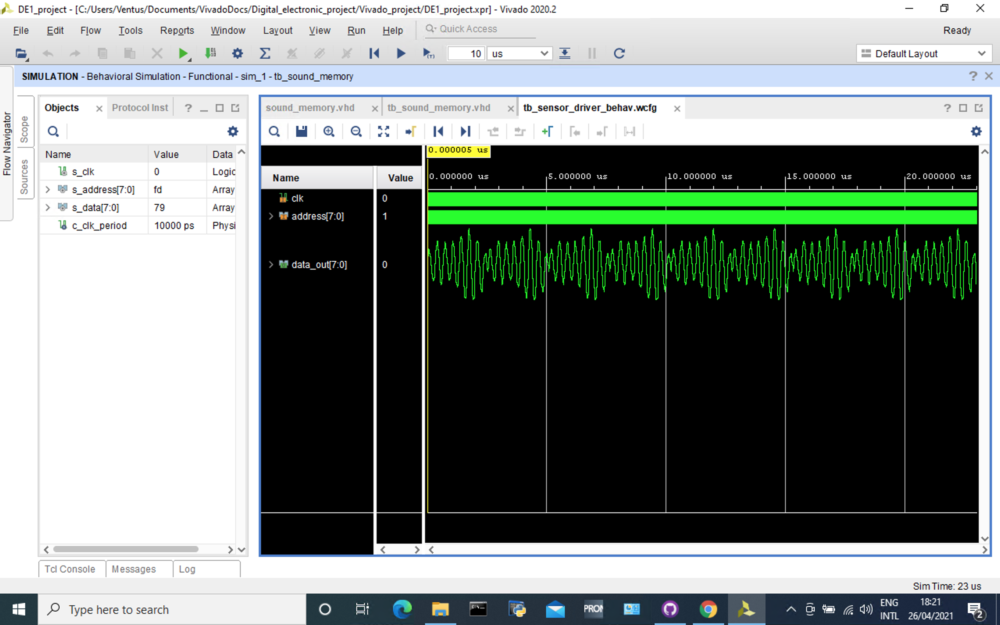
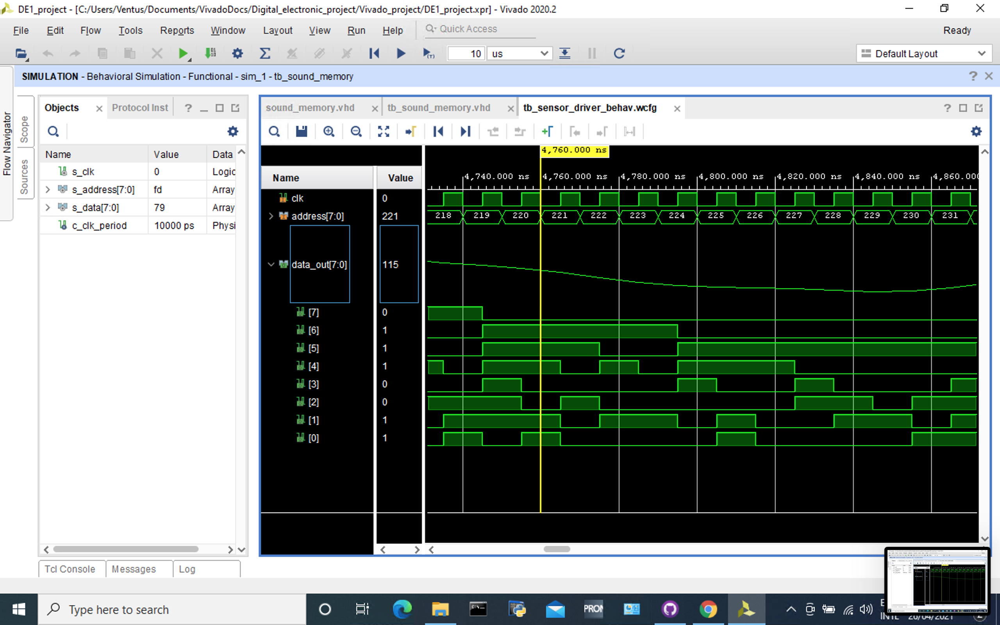
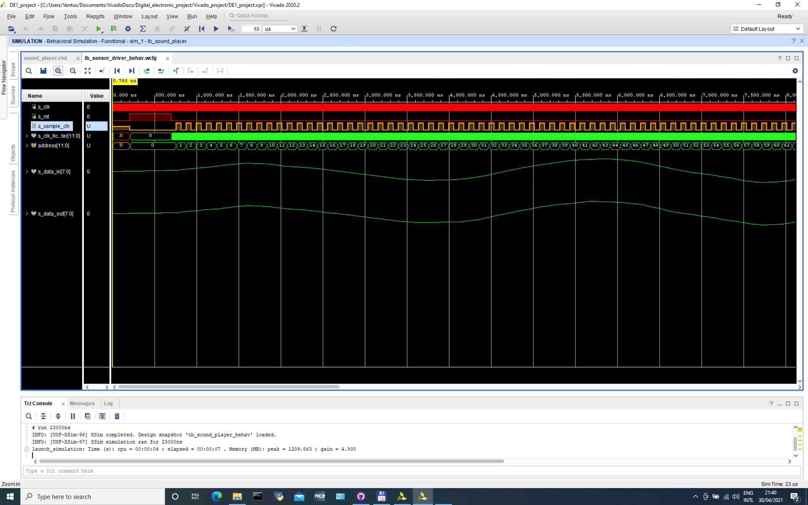
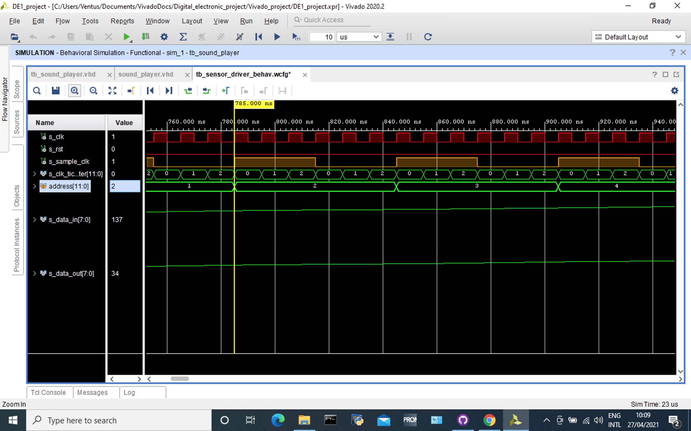

# Sound driver
Obsahuje moduly:
* sound_memory.vhd
* sound_logic.vhd
* pwm DAC `TODO`
* sampler (vyčítání vzorků) `TODO`

# sound_memory:
Modul obsahuje v paměti asi 0.8 sec dlouhý krátký úsek audia (mono).

Převod do unsigned integeru byl proveden za pomocí [skriptu v matlabu](waw2array.m). Výsledek je uložen v [txt souboru](sound_string.txt); pro snadnější formátování po 50 samplech na řádek.

 Audio je normalizováno (pro maximální rozkmit).

**Tech. specifikace:**
* Rozlišení: 8b
* Adresní sběrnice 12b
* Počet vzorků: 2303
* Vzorkovací kmitočet 96000 Hz
* Velikost souboru 8kiB

### Simulace vyčítání z paměti:

### Detail vyčítání z paměti:

# sound_player.vhd
Modul vyčítá jednotlivé vzorky z paměti v přesně stanovený okamžik dle zadaného parametru vzorkování. 

Tento modul má na starosti práci s pamětí a řízení PWM D/A převodníku. Přímo v sobě implementuje entitu paměťového bloku `sound_memory`. Lze zde také nastavit hlasitost konstantou `c_volume`. Vyšší konstanta znamená nižší hlasitost. (Vstupní amplituda z paměti se podělí touto konstantou a zapíše se na výstup `data_out`.)

Je zde vytvořen interní signál hodin `s_sample_clock`, který má periodu vzorkovacího kmitočtu (zde 96kHz). V taktu tohoto signálu dochází právě k vyčítání dat ze zvukové paměti. Po přečtení všech samplů (viz const. `c_n_samples`) se opět opakuje vyčítání od adresy **`0000_0000`**.

**Specifikace:**
* Konstanta hlasitosti `c_volume`
* Konstanta samplovaciho kmitočtu (tiky na hlavní hodinový signál) `c_sample_period`
* vstup 100MHz hodin `clk`
* výstup 8b, vektor pro pwm `data_out`
* výstup 12b, adresní sběrnice pro paměť (interni signal) `s_address`
* vstup 8b paměti (interni signal) `s_data_in`

### Simulace modulu sound_player:
Pro účely simulace:
* `c_sample_period` <= 2
* `c_volume` <= 4
* `c_n_samples` <= 100

Originální hodnoty:
* `c_sample_period` <= 1042 (96kHz při 100MHz clk)
* `c_volume` <=  ad. libitum
* `c_n_samples` <= 2303

### Detail simulace:
