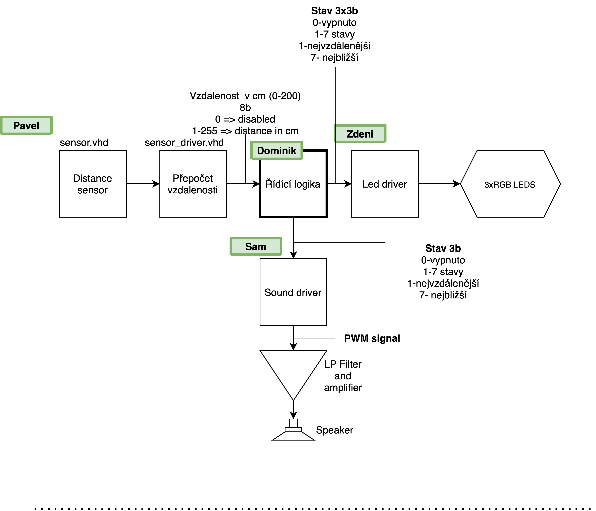

# Parking assistant with HC-SR04 ultrasonic sensor
## Brief description
Three distance sensors for three directions - left, middle, right. Sound signaling using 
PWM and visual signaling using four RGB diodes for each direction.

### Team members:

Turák Samuel   `ID: 221059`

~~Vala David  `ID: xxxxxx`.~~

Vaněk Pavel  `ID: 221072`

Varmužová Zdeňka `ID: 219104`

Zbořil Dominik `ID: 221074`

[Project folder link](https://github.com/Bobik77/Digital_electronic_project)

### Project objectives
* the task:
    * Parking assistant with HC-SR04 ultrasonic sensor, sound signaling using PWM, 
    signaling by LED bargraph.
* to do:
    * [x] Block structure design
    * [x] VHDL modules design and simulations
    * [ ] PCD desk and hardware schemes
    * [x] Top module design and simulation
    * [ ] Documentation
    * [ ] Video presentation

## Hardware description
The project is created on Artys A7-100t board. The rest of necessary components are
placed on PCB desk.
### Artys A7-100t
We used one button for reset signal and clock signal. Then we used four Pmod connectors 
for conecting the board with PCB.
### PCB
The PCB board contains of twelve RGB diodes, three HC-SR04 sensors and ...

## VHDL modules description and simulations
For additional description see README.md files for each module in folder Doc.
### `sensor_driver.vhd`

The task of this module is to compile the data from a sensor and distribute them
to control unit. 

### `control_unit.vhd`

Takes input data from `sensor_driver` and convers them into required output. 
The inputs are three 8b signals, one from each of the sensors. The output is 
a 3b singal for each direction. These signals are input signals for `led_driver`. 
The last output from this module is aslo a 3b signal, which is actually the one of
the previous three with the smallest value. This signal goes to `sound_player`.

### `led_driver.vhd`

The module is the controller of 12 LED diodes. The input signals (3x3b) are sorted 
by value into 6 states. For the greatist distance (over 200 cm) is output zero and 
no led is shining. As the distance is increasing, the leds lights up gradually. 
First and second lit green, the third lid yellow and the last one lid red. For the 
lowest distance are all four leds flashing red.

### `sound_player.vhd`

It works with the memory and controls PWM D/A convertor. It includes the module `sound_memory`

* `sound_memory`
    * Contains a short (0.8 s) section of audio.
    
### `PWM.vhd`

Generates a PWM signal. The signal can only take on values 1 or 0 with various duty cycle.
Input is 8b from `sound_driver.vhd` and the output is 1b.
    
### `sound_logic.vhd`

The module sortes the input into 6 beeping states. The freqency of beeping increases 
with the decreasing distance from the sensors. For the nearist state the speaker makes
sound constantly. Input is 1b from `PWM.vhd` and 3b from `control_unit.vhd` for 
detection of state. Output is 1b which goes to speaker.
    
## TOP module description and simulations
### Top module architecture

### `Top.vhd`

### Simulation of `Top.vhd`

Here we will see specific simulations of each output. The simulation input parameters for the sensor are as follows:

   | **Left sensor distance** | **Middle sensor distance** | **Right sensor distance** |
   | :-: | :-: | :-: |
   | `137 cm` | `206 cm` | `51 cm` |
   | `103 cm` | `144 cm` | `103 cm` |
   | `51 cm` | `124 cm` | `137 cm` |
   | `17 cm` | `103 cm` | `172 cm` |

### Simulation of sensor
This simulation shows us the effect of the corelation between the echo pulse and the distance.

### Simulation of LEDs of left sensor
This simulation shows us not only the LEDS states and the given colour shinning for the left sensor but also the sensor output itself. When both green and red is activated, yellow shines.

### Simulation of LED blinking at state HIGH2

### Simulation of LEDs of middle sensor

### Simulation of LEDs of right sensor

This simulation shows us the sound output - the beeping signal. All sensor outputs are displayed so we can see the dependency of the speaker for the sensor with the object closest to it. For the purpose of this simulation the `on_state` time has been reduced in `sound_logic`.

### Simulation of speaker

### Closer look at PWM signal
This simulation shows us a nearer look at the pwm signal.

## Video

## References

## Discusion about problems 
* Not enough leds on specified board.
    * Solution: Add them to the PCB board.
* Not enough output bits on Artys A7-100t.
    * Solution: Delete the third bits on `led_driver.vhd` output signals, 
    which is always a zero.

---------------------------------------------------------

# Základní skica topologie

# Rozvrh práce
Do 16.4. mějme hotové source kódy. Během víkendu to dáme dohromady a zkusíme první funkčnost. Níže je rozpis práce jednotlivých členů. Libovolně upravujte připisujte, založte si vlastní oddíl...

## Samuel - Audio signalizace
* Vstup z řízení `3b`. 
* `000` odpovídá stavu **vypnuto**
* `001` až `111` odpovídá dalekému stavu až blízkému stavu
* Pomocí **PWM** modulace vytvořit sinusový signál pro reproduktor
* Podle blízkosti se bude měnit rychlost pískání
* může se měnit i kmitočet 

## Zdeni - Led signalizace
* 3x4 **RGB LED** ,každé 4 pro jeden směr - lze řešit separátně, takže stačí napsat jeden modul a zkopírovat.
* Vstup z řízení `3b`. 
* `000` odpovídá stavu **vypnuto**
* `001` až `111` odpovídá dalekému stavu až blízkému stavu
* Zelená pro daleký stav, červená pro blízký stav. stačí rozlišit **4 stavy** (chlapi jsou stejně barvoslepí)
* Pro poslední (nejbižší) stav , může LED začít rychle blikat

## Dominik - Řídící logika
* Vyhodnocení změřené vzdálenosti z driveru senzoru a to převede na 3 b výstup pro **světelnou** a **audio** signalizaci
* Vstup z **senzor_driver** `8b`
* Výstup LED signalizace `3x3b`
* Výstup AUDIO signalizace `1x3b` (vždy se vezme ta nejbližší vzdálenost)
* `000` odpovídá stavu **vypnuto**
* `001` až `111` odpovídá dalekému stavu 
* Ošetření rychlých změn
* Ošetření krátkých zákmitů senzoru (glitch)
*  Průměrování vzorků..?
* Do budoucna možná PCB..? (domluvíme se)

## Pavel - Distance sensor
* Simulace, testbench a driver k senzoru vzdálenosti
* výstup `8b` do řídící logiky

## David - Svačinář
* nám všem doveze kafe a sváču
* ...protože se zatím neozval.
* Pro mě preso bez mlíka a cukru...díky :)

## 22.duben.
Další rozvrh práce na další dva týdny

**TODO list:**
* Top architektura + testbench + celková simulace `PAVEL/SAM` (až po PWM)
* Dokumentace (celková) `ZDENI`
    * Video (5min)
    * Git
    * Projít kódy (komenty)
* PWM driver `SAM`
* LUT (look up table -> memory module) `PAVEL`
* HW `DOMINIK`
    * schemata
    * PCB
    * (hodí se i 3D model ;) )

**Všichni:**
* Letmá dokumentace modulů (vstupy výstupy, simulace...)

# Notes
*Sem pište obecné připomínky, myšlenky, o kterých chcete informovat ostatní. Pro zbytek si založte ve složce dokumentace `Doc` vlastní podsložku která se bude vztahovat k dokumantaci vašeho bloku systému*

* Kdyby cokoliv hořelo, volejte **kdykoliv** na muj tel 731937719, nebo napište na discord.
* dopište nahoru do sekce members svoje id
