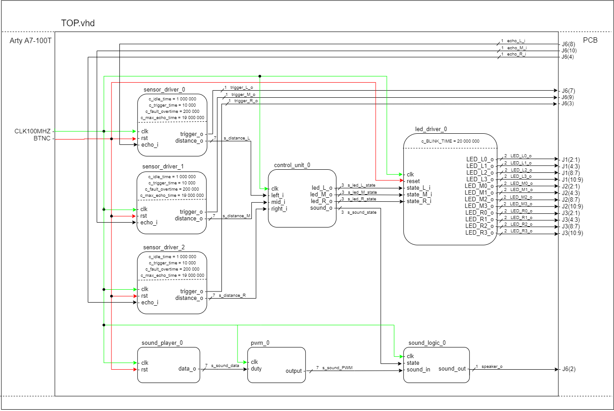

# Parking assistant with HC-SR04 ultrasonic sensor
### Brief description
Three distance sensors for three directions - left, middle, right. Sound signaling using 
PWM and visual signaling using four RGB diodes for each direction.

### Team members:

Turák Samuel   `ID: 221059`

~~Vala David  `ID: xxxxxx`~~

Vaněk Pavel  `ID: 221072`

Varmužová Zdeňka `ID: 219104`

Zbořil Dominik `ID: 221074`

*pozn.: Student Vala David za celou dobu tvorby projektu s týmem jakkoliv nenavázal kontakt*

[Project folder link](https://github.com/Bobik77/Digital_electronic_project)

[Assigment general instructions link](https://github.com/tomas-fryza/Digital-electronics-1/tree/master/Labs/project)

### Project objectives
* the task:
    * Parking assistant with HC-SR04 ultrasonic sensor, sound signaling using PWM, 
    signaling by LED bargraph.
* to do:
    * [x] Block structure design
    * [x] VHDL modules design and simulations
    * [x] PCB desk and hardware schemes
    * [x] Top module design and simulation
    * [ ] Documentation
    * [x] Generate bitstream file
    * [ ] Video presentation

## Hardware description
The project is created on Artys A7-100t board. The rest of necessary components are
placed on PCB desk. 

### Artys A7-100t
We used one button for reset signal and clock signal. Then we used four Pmod connectors 
for conecting the board with PCB.
 

### Periphery PCB
On periphery board are assigned all 3 distance sensors and 12 RGB LEDS, four for each direction. Only red and green emiting chip are used. We could use only two-colour LED, but 3-colours LEDs are more common and in most cases less expensives.

There is also sound small speaker with ĺow-pass filter (used for demodulation of PWM) and op. amplifier. You could see piezo buzzer at 3D model, but cicuit is designed for use standart coil speaker. Piezo model was used only for PCB view.

Distance sensors are powered by 5V (they dont work at 3V3 power supply, I measured it...). Supplying 5V to periphery is realised by 3 wire connection to `J7` header (not shown at 3D model).

Voltage conversion 3V3/5V and vice versa is solved by 2-way MosFET transistor so in future this output/input could be used for different distance sensor.
### Visualization of PCB desk
 

### Scheme
In the picture below we can see the schematic of PCB board. We can divide the schematic into three blocks. The first block consists of only pin head connectors. These connectors are designed for perfect connection with the opposite connectors on the Arty A7 board. There is another one which has only three pins. First pin acts as 5V power supply because we do not have it yet, there is also 3,3V and GND for easy way to connect the board. The second block consists of the systems of RGB diodes which acts as optical visualization. For RGB we don’t need blue diode so there is no reason to link it. Thanks to that we save components and space on the board, but mainly the 12 pins which we don’t have to link. This is the reason why the boards fit so well together. In the third block we have the rest of components. The speaker for audio response and three pin head connectors for distance sensor [HC-SR04](Doc/Distancesensor/CHSR04_datasheet.pdf).

## VHDL modules description and simulations
For additional description see README.md files for each module in folder Doc.
### `sensor_driver.vhd`

The task of this module is to compile the data from a sensor and distribute them
to control unit. The input signal from sensor is echo and output is trigger. The module
sends a signal (trigger) to a sensor and waits for response by echo. Then starts caltulating
and stops when echo signal finishes. Evaluates the data and send them by distance_o 
(8b) signal to the `control_unit.vhd`. 

[*want see more*]('Doc/Distance%20sensor/readme.md')
### `control_unit.vhd`

Takes input data from `sensor_driver` and convers them into required output. 
The inputs are three 8b signals, one from each of the sensors. The output is 
a 3b singal for each direction. These signals are input signals for `led_driver`. 
The last output from this module is aslo a 3b signal, which is actually the one of
the previous three with the smallest value. This signal goes to `sound_player`.

[*want see more*](Doc/Control%20Unit/readme.md)
### `led_driver.vhd`

The module is the controller of 12 LED diodes. The input signals (3x3b) are sorted 
by value into 6 states. For the greatist distance (over 200 cm) is output zero and 
no led is shining. As the distance is increasing, the leds lights up gradually. 
First and second lit green, the third lid yellow and the last one lid red. For the 
lowest distance are all four leds flashing red.

[*want see more*](Doc/Ledd%20river/readme.md)

### `sound_player.vhd`

It works with the memory and controls PWM D/A convertor. It includes the module `sound_memory`

* `sound_memory`
    * Contains a short (0.8 s) section of audio.
    
[*want see more*](Doc/Sound%20driver/readme.md)
### `PWM.vhd`

Generates a PWM signal. The signal can only take on values 1 or 0 with various duty cycle.
Input is 8b from `sound_driver.vhd` and the output is 1b.

[*want see more*](Doc/Sound%20driver/readme.md)
    
### `sound_logic.vhd`

The module sortes the input into 6 beeping states. The freqency of beeping increases 
with the decreasing distance from the sensors. For the nearist state the speaker makes
sound constantly. Input is 1b from `PWM.vhd` and 3b from `control_unit.vhd` for 
detection of state. Output is 1b which goes to speaker.
    
[*want see more*](Doc/Sound%20driver/readme.md)
## TOP module description and simulations
### Top module architecture

### Simulation of `Top.vhd`

Here we will see specific simulations of each output. The simulation input parameters for the sensor are as follows:

   | **Left sensor distance** | **Middle sensor distance** | **Right sensor distance** |
   | :-: | :-: | :-: |
   | `137 cm` | `206 cm` | `51 cm` |
   | `103 cm` | `144 cm` | `103 cm` |
   | `51 cm` | `124 cm` | `137 cm` |
   | `17 cm` | `103 cm` | `172 cm` |

### Simulation of sensor
This simulation shows us the effect of the corelation between the echo pulse and the distance.

### Simulation of LEDs of left sensor
This simulation shows us not only the LEDS states and the given colour shinning for the left sensor but also the sensor output itself. When both green and red is activated, yellow shines.

### Simulation of LED blinking at state HIGH2

### Simulation of LEDs of middle sensor

### Simulation of LEDs of right sensor

### Simulation of the speaker
This simulation shows us the sound output - the beeping signal. All sensor outputs are displayed so we can see the dependency of the speaker for the sensor with the object closest to it. For the purpose of this simulation the `on_state` time has been reduced in `sound_logic`.

### Closer look at PWM signal
This simulation shows us a nearer look at the pwm signal.

## Video
[Link to video](https://...)

## References
*  [Arty A7-100t board documentacion](https://store.digilentinc.com/arty-a7-artix-7-fpga-development-board/)
* [Arty A7-100t board scheme](https://reference.digilentinc.com/_media/reference/programmable-logic/arty-a7/arty_a7_sch.pdf)
* [Arty A7-100t board constraints guide](https://raw.githubusercontent.com/Digilent/digilent-xdc/master/Arty-A7-100-Master.xdc)

## Discusion about problems 
* Not enough leds on specified board.
    * Solution: Add them to the PCB board.
* Not enough output bits on Artys A7-100t.
    * Solution: Delete the third bits on `led_driver.vhd` output signals, 
    which is always a zero.
